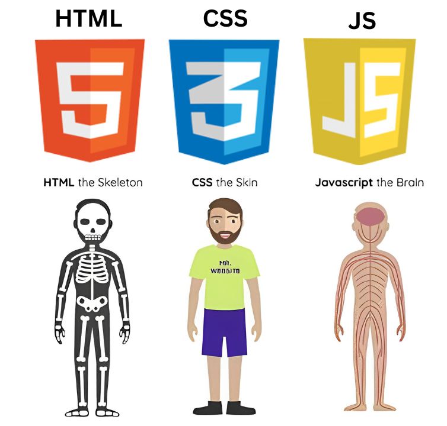

  

<h1 align="center">🌐 រៀន HTML5 ពេញលេញជាភាសាខ្មែរ (Learn HTML5 in Khmer)</h1>

  <b>HTML (HyperText Markup Language)</b> គឺជាភាសាស្តង់ដារគ្រឹះដ៏សំខាន់បំផុតសម្រាប់សាងសង់រចនាសម្ព័ន្ធគេហទំព័រ (Web Pages) ទាំងអស់នៅលើពិភពលោក។

  កម្រងមេរៀននេះត្រូវបានរៀបចំ និងចងក្រងឡើងជា <b>HTML5 Master Course ស្តង់ដារពេញលេញ</b> ដោយបានពន្យល់ជាភាសាខ្មែរយ៉ាងក្បោះក្បាយ រក្សាទុកពាក្យបច្ចេកទេសជាភាសាអង់គ្លេស ១០០% មានកូដគំរូជាក់ស្តែងអាច Run បានភ្លាមៗ រូបភាព SVG Diagrams ពន្យល់ក្បោះក្បាយ លំហាត់អនុវត្ត និង Capstone Projects សម្រាប់បង្រៀនសិស្ស។

---

## 🎭 ការប្រៀបធៀបតួនាទីរវាង HTML, CSS និង JavaScript (The Trio Analogy)

  

* 🦴 **HTML (The Skeleton - គ្រោងឆ្អឹង):** សាងសង់រចនាសម្ព័ន្ធគ្រោងឆ្អឹង និងមាតិកា (Headings, Paragraphs, Buttons, Forms, Tables)។
* 👕 **CSS (The Skin & Clothes - ស្បែក និងសម្លៀកបំពាក់):** កំណត់ពណ៌ ស្ទីល រូបរាង ប្លង់ និងភាពស្រស់ស្អាត (Colors, Layouts, Animations)។
* 🧠 **JavaScript (The Brain & Nerves - ខួរក្បាល និងប្រព័ន្ធប្រសាទ):** បញ្ជាចលនា Logic និងអន្តរកម្មឆ្លើយតប (Interactivity, APIs, Data Flow)។

---

## 🎨 រូបភាព និងដ្យាក្រាមពន្យល់ក្នុងមេរៀន (Visual Diagrams Included)

កម្រងមេរៀននេះមានបង្កប់ **SVG Vector Diagrams គុណភាពខ្ពស់ (Crisp & Clear)** នៅគ្រប់មេរៀនស្នូល ដើម្បីជួយឱ្យសិស្សមើលយល់ភ្លាមៗ៖

| # | រូបភាពដ្យាក្រាម (Diagram Topic) | មេរៀនដែលបានបង្កប់ (Embedded Lesson) |
| :---: | :--- | :--- |
| 01 | 🌳 **HTML DOM Tree Structure** | [01-introduction.md](lessons/01-introduction.md), [03-basic-structure.md](lessons/03-basic-structure.md) |
| 02 | 🧩 **HTML Element Anatomy** (Start Tag, Content, End Tag) | [04-elements.md](lessons/04-elements.md) |
| 03 | 🔍 **Attribute Anatomy** (`name="value"`) | [05-attributes.md](lessons/05-attributes.md) |
| 04 | 📊 **Headings Hierarchy** (`<h1>` ដល់ `<h6>` & SEO Rule) | [06-headings.md](lessons/06-headings.md) |
| 05 | 🎨 **3 Ways of Adding CSS** (Inline, Internal, External) | [12-css-integration.md](lessons/12-css-integration.md) |
| 06 | 🗂️ **Table Structure, Colspan & Rowspan** | [16-tables.md](lessons/16-tables.md) |
| 07 | 🧱 **Block vs Inline Elements Visual** | [18-block-and-inline.md](lessons/18-block-and-inline.md) |
| 08 | 🏷️ **Class (Shared) vs ID (Unique) Visual** | [20-classes-and-id.md](lessons/20-classes-and-id.md) |
| 09 | 🪟 **Iframe Embedding Architecture** | [21-iframes.md](lessons/21-iframes.md) |
| 10 | 📁 **Folder Tree & File Paths** (`./`, `../`, `images/`) | [23-file-paths.md](lessons/23-file-paths.md) |
| 11 | 📱 **Responsive Viewport on Devices** (Mobile/Tablet/Desktop) | [25-layout-and-responsive.md](lessons/25-layout-and-responsive.md) |
| 12 | 🏗️ **HTML5 Semantic Layout** (`<header>`, `<nav>`, `<main>`, `<article>`) | [27-semantic-elements.md](lessons/27-semantic-elements.md) |
| 13 | 📝 **HTML Form Anatomy & Client-Server Data Flow** | [31-forms-intro.md](lessons/31-forms-intro.md) |
| 14 | 🔍 **Canvas (Raster Pixel) vs SVG (Vector Math)** | [38-svg.md](lessons/38-svg.md) |
| 15 | 💾 **localStorage vs sessionStorage Lifecycle** | [45-web-storage-api.md](lessons/45-web-storage-api.md) |
| 16 | ⚡ **Main UI Thread vs Background Worker Thread** | [46-web-workers-api.md](lessons/46-web-workers-api.md) |
| 17 | 📡 **Polling vs SSE vs WebSockets Comparison** | [47-server-sent-events-api.md](lessons/47-server-sent-events-api.md) |

---

## 📚 មាតិកាមេរៀនទាំងអស់ (Table of Contents - 47 Lessons)

### 🔹 Module 1: HTML Core & Structure (មូលដ្ឋានគ្រឹះ HTML)

| ល.រ | មេរៀន (Lesson Title) | ឯកសារមេរៀន (Lesson File) | កូដគំរូ (Demo Code) |
| :---: | :--- | :---: | :---: |
| **01** | សេចក្តីណែនាំអំពី HTML (HTML Introduction) | [01-introduction.md](lessons/01-introduction.md) | [01-basic-structure.html](demos/01-basic-structure.html) |
| **02** | កម្មវិធីសរសេរកូដ HTML (HTML Editors) | [02-editors.md](lessons/02-editors.md) | - |
| **03** | រចនាសម្ព័ន្ធមូលដ្ឋាននៃឯកសារ HTML (HTML Basic Structure) | [03-basic-structure.md](lessons/03-basic-structure.md) | [01-basic-structure.html](demos/01-basic-structure.html) |
| **04** | ធាតុ និងស្លាកក្នុង HTML (HTML Elements & Tags) | [04-elements.md](lessons/04-elements.md) | [01-basic-structure.html](demos/01-basic-structure.html) |
| **05** | លក្ខណៈសម្បត្តិរបស់ធាតុ (HTML Attributes) | [05-attributes.md](lessons/05-attributes.md) | [02-formatting-and-links.html](demos/02-formatting-and-links.html) |
| **06** | ចំណងជើងក្នុង HTML (HTML Headings: h1 - h6) | [06-headings.md](lessons/06-headings.md) | [02-formatting-and-links.html](demos/02-formatting-and-links.html) |
| **07** | កថាខណ្ឌ និងការចុះបន្ទាត់ (HTML Paragraphs & Line Breaks) | [07-paragraphs.md](lessons/07-paragraphs.md) | [02-formatting-and-links.html](demos/02-formatting-and-links.html) |
| **08** | ការកំណត់ Style និងពណ៌ (HTML Styles & Colors) | [08-styles-and-colors.md](lessons/08-styles-and-colors.md) | [02-formatting-and-links.html](demos/02-formatting-and-links.html) |
| **09** | ទម្រង់អត្ថបទ (HTML Text Formatting) | [09-text-formatting.md](lessons/09-text-formatting.md) | [02-formatting-and-links.html](demos/02-formatting-and-links.html) |
| **10** | សម្រង់សម្តី និងប្រភព (HTML Quotations & Citations) | [10-quotations-and-citations.md](lessons/10-quotations-and-citations.md) | - |
| **11** | ការដាក់ចំណាំក្នុងកូដ (HTML Comments) | [11-comments.md](lessons/11-comments.md) | - |
| **12** | ការភ្ជាប់ CSS ជាមួយ HTML (HTML CSS Integration) | [12-css-integration.md](lessons/12-css-integration.md) | [06-semantic-layout.html](demos/06-semantic-layout.html) |
| **13** | តំណភ្ជាប់ Hyperlink (HTML Links) | [13-links.md](lessons/13-links.md) | [02-formatting-and-links.html](demos/02-formatting-and-links.html) |
| **14** | ការប្រើប្រាស់រូបភាព (HTML Images & Picture) | [14-images.md](lessons/14-images.md) | [03-images-and-media.html](demos/03-images-and-media.html) |
| **15** | Favicon និងចំណងជើង Tab (HTML Favicon & Page Title) | [15-favicon-and-title.md](lessons/15-favicon-and-title.md) | - |
| **16** | តារាងទិន្នន័យ (HTML Tables) | [16-tables.md](lessons/16-tables.md) | [04-tables-and-lists.html](demos/04-tables-and-lists.html) |
| **17** | បញ្ជីរាយនាម (HTML Lists: ul, ol, dl) | [17-lists.md](lessons/17-lists.md) | [04-tables-and-lists.html](demos/04-tables-and-lists.html) |
| **18** | ធាតុ Block និង Inline (HTML Block vs Inline Elements) | [18-block-and-inline.md](lessons/18-block-and-inline.md) | - |
| **19** | ធាតុ Container `
` និង `` (HTML Div & Span) | [19-div-and-span.md](lessons/19-div-and-span.md) | [06-semantic-layout.html](demos/06-semantic-layout.html) |
| **20** | ការប្រើប្រាស់ Class និង ID (HTML Classes & ID) | [20-classes-and-id.md](lessons/20-classes-and-id.md) | [06-semantic-layout.html](demos/06-semantic-layout.html) |
| **21** | បង្អួចបង្កប់គេហទំព័រ (HTML Iframes) | [21-iframes.md](lessons/21-iframes.md) | [03-images-and-media.html](demos/03-images-and-media.html) |
| **22** | ការប្រើ JavaScript ក្នុង HTML (HTML JavaScript Integration) | [22-javascript.md](lessons/22-javascript.md) | [08-web-storage-api.html](demos/08-web-storage-api.html) |
| **23** | ផ្លូវឯកសារ Relative និង Absolute (HTML File Paths) | [23-file-paths.md](lessons/23-file-paths.md) | - |
| **24** | ផ្នែកក្បាលគេហទំព័រ និង Meta Tags (HTML Head & Meta) | [24-head-and-meta.md](lessons/24-head-and-meta.md) | - |
| **25** | ប្លង់គេហទំព័រ និង Responsive Design (HTML Layout & Responsive) | [25-layout-and-responsive.md](lessons/25-layout-and-responsive.md) | [06-semantic-layout.html](demos/06-semantic-layout.html) |
| **26** | ធាតុបង្ហាញកូដកុំព្យូទ័រ (HTML Computer Code Elements) | [26-computercode.md](lessons/26-computercode.md) | - |
| **27** | ធាតុ Semantic ស្តង់ដារ (HTML Semantic Elements) | [27-semantic-elements.md](lessons/27-semantic-elements.md) | [06-semantic-layout.html](demos/06-semantic-layout.html) |
| **28** | ស្តង់ដារនៃការសរសេរកូដ (HTML Style Guide & Best Practices) | [28-style-guide.md](lessons/28-style-guide.md) | - |
| **29** | តួអក្សរពិសេស និមិត្តសញ្ញា និង Emoji (HTML Entities, Symbols, Emojis) | [29-entities-symbols-emojis.md](lessons/29-entities-symbols-emojis.md) | - |
| **30** | ការកំណត់ Charset និង URL Encoding (HTML Charset & URL Encode) | [30-charset-and-url-encode.md](lessons/30-charset-and-url-encode.md) | - |

---

### 🔹 Module 2: HTML Forms & User Inputs (ទម្រង់បែបបទ)

| ល.រ | មេរៀន (Lesson Title) | ឯកសារមេរៀន (Lesson File) | កូដគំរូ (Demo Code) |
| :---: | :--- | :---: | :---: |
| **31** | សេចក្តីណែនាំអំពី HTML Forms (HTML Forms Introduction) | [31-forms-intro.md](lessons/31-forms-intro.md) | [05-registration-form.html](demos/05-registration-form.html) |
| **32** | លក្ខណៈសម្បត្តិនៃ Form (HTML Form Attributes) | [32-form-attributes.md](lessons/32-form-attributes.md) | [05-registration-form.html](demos/05-registration-form.html) |
| **33** | ធាតុផ្សេងៗក្នុង Form (HTML Form Elements) | [33-form-elements.md](lessons/33-form-elements.md) | [05-registration-form.html](demos/05-registration-form.html) |
| **34** | ប្រភេទនៃ Input ទាំងអស់ (HTML Input Types) | [34-input-types.md](lessons/34-input-types.md) | [05-registration-form.html](demos/05-registration-form.html) |
| **35** | លក្ខណៈសម្បត្តិរបស់ Input (HTML Input Attributes) | [35-input-attributes.md](lessons/35-input-attributes.md) | [05-registration-form.html](demos/05-registration-form.html) |
| **36** | Form Attributes របស់ Input (HTML Input Form Attributes) | [36-input-form-attributes.md](lessons/36-input-form-attributes.md) | [05-registration-form.html](demos/05-registration-form.html) |

---

### 🔹 Module 3: HTML Graphics (ក្រាហ្វិក)

| ល.រ | មេរៀន (Lesson Title) | ឯកសារមេរៀន (Lesson File) | កូដគំរូ (Demo Code) |
| :---: | :--- | :---: | :---: |
| **37** | ផ្ទាំងគំនូរកូដ (HTML5 Canvas) | [37-canvas.md](lessons/37-canvas.md) | [07-canvas-and-svg.html](demos/07-canvas-and-svg.html) |
| **38** | រូបភាពវ៉ិចទ័រ (HTML5 SVG) | [38-svg.md](lessons/38-svg.md) | [07-canvas-and-svg.html](demos/07-canvas-and-svg.html) |

---

### 🔹 Module 4: HTML Media & Multimedia (ប្រព័ន្ធផ្សព្វផ្សាយ)

| ល.រ | មេរៀន (Lesson Title) | ឯកសារមេរៀន (Lesson File) | កូដគំរូ (Demo Code) |
| :---: | :--- | :---: | :---: |
| **39** | ប្រព័ន្ធផ្សព្វផ្សាយ និង Plugins (HTML Media & Plugins) | [39-media-and-plugins.md](lessons/39-media-and-plugins.md) | [03-images-and-media.html](demos/03-images-and-media.html) |
| **40** | វីដេអូក្នុង HTML (HTML Video) | [40-video.md](lessons/40-video.md) | [03-images-and-media.html](demos/03-images-and-media.html) |
| **41** | សំឡេងក្នុង HTML (HTML Audio) | [41-audio.md](lessons/41-audio.md) | [03-images-and-media.html](demos/03-images-and-media.html) |
| **42** | ការបង្កប់វីដេអូ YouTube (HTML YouTube Embed) | [42-youtube-embed.md](lessons/42-youtube-embed.md) | [03-images-and-media.html](demos/03-images-and-media.html) |

---

### 🔹 Module 5: Advanced HTML5 Web APIs

| ល.រ | មេរៀន (Lesson Title) | ឯកសារមេរៀន (Lesson File) | កូដគំរូ (Demo Code) |
| :---: | :--- | :---: | :---: |
| **43** | Geolocation API (ការទាញយកទីតាំង GPS) | [43-geolocation-api.md](lessons/43-geolocation-api.md) | [08-web-storage-api.html](demos/08-web-storage-api.html) |
| **44** | Drag and Drop API (ការអូសទម្លាក់) | [44-drag-and-drop-api.md](lessons/44-drag-and-drop-api.md) | - |
| **45** | Web Storage API (localStorage & sessionStorage) | [45-web-storage-api.md](lessons/45-web-storage-api.md) | [08-web-storage-api.html](demos/08-web-storage-api.html) |
| **46** | Web Workers API (ការដំណើរការលើ Background) | [46-web-workers-api.md](lessons/46-web-workers-api.md) | - |
| **47** | Server-Sent Events API (ការទទួល Real-time Events) | [47-server-sent-events-api.md](lessons/47-server-sent-events-api.md) | - |

---

## 🎯 កម្រងលំហាត់ និងគម្រោងអនុវត្ត (Exercises & Capstone Projects)

* 📝 [Exercise 01: បង្កើតទំព័រព័ត៌មានផ្ទាល់ខ្លួន (Personal Profile)](exercises/exercise-01-personal-profile.md)
* 📝 [Exercise 02: បង្កើតតារាងម៉ឺនុយម្ហូបភោជនីយដ្ឋាន (Restaurant Menu Table)](exercises/exercise-02-restaurant-menu.md)
* 📝 [Exercise 03: បង្កើតទម្រង់ចុះឈ្មោះសិស្ស (Student Registration Form)](exercises/exercise-03-student-survey-form.md)
* 📝 [Exercise 04: បង្កើតប្លង់គេហទំព័រព័ត៌មាន (News/Blog Semantic Layout)](exercises/exercise-04-news-blog-layout.md)
* 🏆 [Capstone Project 01: Portfolio Website ពេញលេញ](projects/project-01-portfolio-website/README.md)
* 🏆 [Capstone Project 02: E-Commerce Product Showcase Page](projects/project-02-ecommerce-product-page/README.md)

---

## 🚀 របៀបបើក និងដំណើរការកូដគំរូ (Quick Start for Students)

1. **បើក Folder ក្នុង Visual Studio Code:**
   បើក folder `07-html-course` នៅក្នុង VS Code។
2. **ដំឡើង Extension Live Server:**
   ស្វែងរក និងដំឡើង `Live Server` (by Ritwick Dey) ក្នុង VS Code Extension Store។
3. **ដំណើរការ Demo HTML File:**
   ចុចកណ្ដុរស្ដាំ (Right-click) លើ file ណាមួយក្នុង folder `demos/` (ឧទាហរណ៍ `01-basic-structure.html`) រួចជ្រើសរើស **"Open with Live Server"**។

---

## 📜 ឯកសារយោង និងស្តង់ដារអន្តរជាតិ (References & Standards)

* 🔗 [MDN Web Docs - HTML Developer Guide](https://developer.mozilla.org/en-US/docs/Web/HTML)
* 🔗 [W3C HTML5 Official Specification](https://www.w3.org/TR/html52/)
* 🔗 [WHATWG HTML Living Standard](https://html.spec.whatwg.org/)
