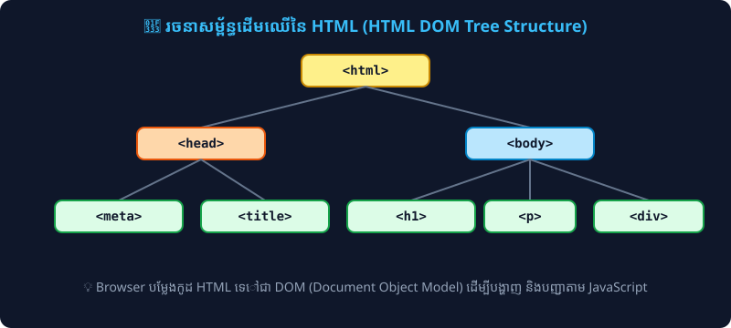

# មេរៀនទី ០១៖ សេចក្តីណែនាំអំពី HTML (HTML Introduction)

> **HTML គឺជាភាសាស្តង់ដារគ្រឹះសម្រាប់បង្កើតគេហទំព័រ (Standard Markup Language for Web Pages)។**

---

## 🎭 ទំនាក់ទំនងរវាង HTML, CSS និង JavaScript (The Web Trio Analogy)

ដើម្បីងាយយល់ពីតួនាទីរបស់ **HTML** ក្នុងពិភព Web Development យើងអាចប្រៀបធៀបវាទៅនឹងរាងកាយមនុស្ស៖

<p align="center">
  
</p>

* 🦴 **HTML (The Skeleton - គ្រោងឆ្អឹង):** កំណត់គ្រោងឆ្អឹង រចនាសម្ព័ន្ធ និងមាតិកាគ្រឹះ (ដូចជា ចំណងជើង កថាខណ្ឌ រូបភាព ប៊ូតុង)។
* 👕 **CSS (The Skin & Clothes - ស្បែក និងសម្លៀកបំពាក់):** កំណត់សោភ័ណភាព រូបរាង ពណ៌ ពុម្ពអក្សរ និងប្លង់ឱ្យស្រស់ស្អាត។
* 🧠 **JavaScript (The Brain & Nerves - ខួរក្បាល និងប្រព័ន្ធប្រសាទ):** កំណត់ការគិត Logic បញ្ជាចលនា និងបង្កើតអន្តរកម្មឆ្លើយតបជាមួយអ្នកប្រើប្រាស់។

---

## ១. HTML ជាអ្វី? (What is HTML?)

**HTML** តំណាងឱ្យ **HyperText Markup Language**៖
* **HyperText:** សំដៅលើអត្ថបទដែលមានតំណភ្ជាប់ (Links / Hyperlinks) អាចឱ្យអ្នកប្រើប្រាស់ចុចផ្លាស់ទីពីទំព័រមួយទៅកាន់ទំព័រមួយទៀតបាន។
* **Markup Language:** ភាសាដែលប្រើប្រាស់ **Tags** ដើម្បីកំណត់រចនាសម្ព័ន្ធ មាតិកា និងប្លង់នៃទំព័រ (ដូចជា កថាខណ្ឌ ចំណងជើង តារាង រូបភាពជាដើម)។

> 💡 **ចំណាំសំខាន់:** HTML **មិនមែនជា Programming Language** ដូចជា C++, Java ឬ Python នោះទេ ព្រោះវាមិនមាន Logic, Conditions (`if/else`) ឬ Loops (`for/while`) ឡើយ។ វាគឺជា **Markup Language** សម្រាប់រៀបចំគ្រោងឆ្អឹងរបស់គេហទំព័រ។

---

## ២. ឧទាហរណ៍ឯកសារ HTML សាមញ្ញ (Simple HTML Document)

```html
<!DOCTYPE html>
<html>
<head>
  <title>ចំណងជើងទំព័រ (Page Title)</title>
</head>
<body>

  <h1>ចំណងជើងធំដំបូងរបស់ខ្ញុំ (My First Heading)</h1>
  <p>កថាខណ្ឌដំបូងរបស់ខ្ញុំ (My first paragraph).</p>

</body>
</html>
```

### ការពន្យល់អំពីកូដនីមួយៗ (Code Explanation):
* `<!DOCTYPE html>`: ប្រកាសប្រាប់ Browser ថាឯកសារនេះប្រើប្រាស់ស្តង់ដារ **HTML5**។
* `<html>`: Root element ដែលក្តោបមាតិកាគេហទំព័រទាំងអស់។
* `<head>`: ផ្ទុកទិន្នន័យសម្គាល់ (Metadata) អំពីទំព័រ ដូចជា Title, Charset, Styles ជាដើម។
* `<title>`: កំណត់ឈ្មោះចំណងជើងដែលត្រូវបង្ហាញលើ Tab របស់ Web Browser។
* `<body>`: ផ្ទុកមាតិកាដែលអាចមើលឃើញទាំងអស់នៅលើអេក្រង់ (ដូចជា Headings, Paragraphs, Images, Links, Tables)។
* `<h1>`: កំណត់ចំណងជើងកម្រិតធំបំផុត (Heading Level 1)។
* `<p>`: កំណត់កថាខណ្ឌអត្ថបទ (Paragraph)។

---

## ៣. តើ Web Browser ដំណើរការ HTML ដូចម្តេច? (How Browsers Work)

គោលបំណងចម្បងរបស់ **Web Browser** (ដូចជា Google Chrome, Safari, Microsoft Edge, Firefox) គឺអានឯកសារ HTML ហើយបម្លែង (Render) វាឱ្យចេញជាផ្ទាំងទំព័រដែលស្អាត និងងាយស្រួលអាន។

Browser មិនបង្ហាញ Tags (`<h1>`, `<p>`) ឱ្យអ្នកប្រើប្រាស់ឃើញផ្ទាល់ឡើយ ប៉ុន្តែវាប្រើប្រាស់ Tags ទាំងនោះដើម្បីដឹងថាតើត្រូវបង្ហាញមាតិកានោះតាមរបៀបណា។

<p align="center">
  
</p>

---

## ៤. ប្រវត្តិសង្ខេបនៃ HTML (HTML History)

* **1991:** Tim Berners-Lee បានបង្កើត HTML ដំបូងបង្អស់។
* **1995:** HTML 2.0 ត្រូវបានបង្កើតឡើង។
* **1997:** W3C Recommendation ចេញផ្សាយ HTML 3.2។
* **1999:** HTML 4.01 ក្លាយជាស្តង់ដារពេញនិយមទូទាំងពិភពលោក។
* **2014:** **HTML5** ត្រូវបានប្រកាសជាផ្លូវការដោយ W3C ដោយបានបន្ថែម Semantic tags, Video/Audio natively, Canvas, និង Web APIs ទំនើបៗ។

---

## ✍️ លំហាត់អនុវត្តសម្រាប់សិស្ស (Practice Exercises)

1. ចូរពន្យល់ពីអត្ថន័យនៃពាក្យកាត់ **HTML** ជាភាសាអង់គ្លេស។
2. តាមរយៈរូបភាពប្រៀបធៀបខាងលើ ចូរពន្យល់ពីតួនាទីខុសគ្នារវាង HTML, CSS និង JavaScript។
3. បង្កើត file មួយឈ្មោះ `index.html` ហើយសរសេររចនាសម្ព័ន្ធមូលដ្ឋានដោយមាន `<h1>` ដាក់ឈ្មោះរបស់អ្នក និង `<p>` ដាក់ជីវប្រវត្តិសង្ខេប។

---

<details>
<summary>📄 English Summary & Key Takeaways</summary>

* HTML stands for Hyper Text Markup Language
* HTML is the standard markup language for creating Web pages
* HTML describes the structure of a Web page
* HTML consists of a series of elements
* HTML elements tell the browser how to display the content
</details>
