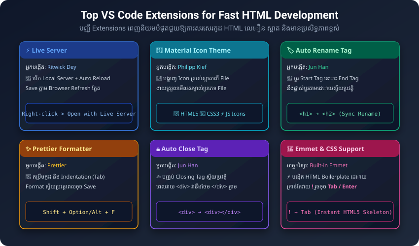

# មេរៀនទី ០២៖ កម្មវិធីសរសេរកូដ និងការរៀបចំ (HTML Editors & Setup)

> **យើងអាចសរសេរកូដ HTML ដោយប្រើប្រាស់ Text Editor ណាមួយក៏បាន ប៉ុន្តែការប្រើប្រាស់ Professional Code Editor ដូចជា Visual Studio Code (VS Code) ជួយឱ្យយើងសរសេរកូដបានលឿន ស្អាត និងគ្មាន Error។**

---

## ១. កម្មវិធីសរសេរកូដដែលពេញនិយមបំផុត (Popular HTML Editors)

សម្រាប់ការរៀន និងធ្វើការងារជា Web Developer អាជីព កម្មវិធីដែលត្រូវបានណែនាំឱ្យប្រើរួមមាន៖

1. **Visual Studio Code (VS Code):** (ណែនាំខ្លាំងបំផុត ⭐⭐⭐⭐⭐)
   * ឥតគិតថ្លៃ (Free & Open Source) បង្កើតដោយក្រុមហ៊ុន Microsoft
   * មាន Extensions រាប់ពាន់ជួយសម្រួល និងបង្កើនល្បឿនសរសេរកូដ
   * មាន Built-in Terminal, Git Integration, និង Live Debugging
2. **Sublime Text:** ស្រាល ដំណើរការលឿនខ្លាំង
3. **Notepad++ (Windows) / TextEdit (macOS):** កម្មវិធីធម្មតាសម្រាប់សរសេរបឋម

---

## ២. បណ្តា Extensions ពេញនិយមបំផុតសម្រាប់សរសេរ HTML បានលឿន (Top VS Code Extensions)



ដើម្បីបង្កើនល្បឿន និងប្រសិទ្ធភាពក្នុងការសរសេរកូដ Web Development អ្នកគួរដំឡើង Extensions ខាងក្រោមក្នុង VS Code (ចុចផ្លូវកាត់ `Ctrl + Shift + X` លើ Windows ឬ `Cmd + Shift + X` លើ macOS ដើម្បីស្វែងរកដំឡើង)៖

| # | ឈ្មោះ Extension | អ្នកបង្កើត (Author) | អត្ថប្រយោជន៍ និងមុខងារសំខាន់ៗ |
| :---: | :--- | :--- | :--- |
| **1** | **Live Server** | Ritwick Dey | ⚡ បង្កើត Local Server ជាមួយមុខងារ **Auto-Reload**។ រាល់ពេលចុច Save (`Ctrl+S` / `Cmd+S`) Browser នឹង Refresh បង្ហាញលទ្ធផលភ្លាមៗ ដោយមិនបាច់ចុច Reload ដោយដៃឡើយ។ |
| **2** | **Material Icon Theme** | Philipp Kief | 🎨 ផ្លាស់ប្តូររូប Icon នៃ File និង Folder ឱ្យស្រស់ស្អាត (HTML5, CSS3, JS, Images, Folders) ងាយស្រួលមើលសម្គាល់មិនច្រឡំ។ |
| **3** | **Auto Rename Tag** | Jun Han | 🏷️ ពេលអ្នកកែឈ្មោះ Start Tag (ឧ. `<h1>` ទៅ `<h2>`) នោះ End Tag (`</h1>` ទៅ `</h2>`) នឹងប្តូរតាមដោយស្វ័យប្រវត្តិ មិនបាច់កែពីរដង។ |
| **4** | **Auto Close Tag** | Jun Han | 🔒 ជួយបិទ Closing Tag ដោយស្វ័យប្រវត្ត ពេលអ្នកវាយ `<div` រួចវាយ `>` វានឹងបង្កើត `</div>` ឱ្យភ្លាម។ |
| **5** | **Prettier - Code Formatter** | Prettier | ✨ តម្រឹមកូដ និងគម្លាតបន្ទាត់ (Indentation / Tab) ឱ្យស្អាតមានរបៀបតាមស្តង់ដារ ដោយស្វ័យប្រវត្តពេលចុច Save ឬចុចកាត់ `Shift + Option/Alt + F`។ |
| **6** | **HTML CSS Support** | ecmel | 💡 ជួយ Suggest ឈ្មោះ CSS Class និង ID នៅក្នុង HTML ដោយស្វ័យប្រវត្តិ (IntelliSense)។ |
| **7** | **Highlight Matching Tag** | Vincas Stonys | 🔍 គូសបន្ទាត់សម្គាល់គូ Tag បើក និង Tag បិទ ងាយស្រួលរកកន្លែងកូដវែងៗ។ |
| **8** | **Color Highlight** | Sergii N | 🌈 បង្ហាញផ្ទាំងពណ៌ពិតប្រាកដលើលេខកូដ HEX, RGB, HSL នៅក្នុង Editor ផ្ទាល់។ |

---

## ៣. គន្លឹះសរសេរកូដលឿនជាមួយ Emmet (Built-in Shortcuts)

VS Code មានមុខងារ **Emmet** ភ្ជាប់មកស្រាប់ដោយស្វ័យប្រវត្តិ៖
* វាយ `!` រួចចុច `Tab` ឬ `Enter` ➔ បង្កើតគ្រោងឆ្អឹង HTML5 Boilerplate ពេញលេញភ្លាមៗ
* វាយ `h1.title` ➔ បង្កើត `<h1 class="title"></h1>`
* វាយ `ul>li*4` ➔ បង្កើត `<ul>` ដែលមាន `<li>` ចំនួន ៤ ខាងក្នុង
* វាយ `p.contact#phone` ➔ បង្កើត `<p class="contact" id="phone"></p>`

---

## ៤. ជំហានជាក់ស្តែងក្នុងការបង្កើតគេហទំព័រ និងដំណើរការជាមួយ Live Server

ខាងក្រោមនេះជាការណែនាំបង្កើតគម្រោងគេហទំព័រដំបូងឈ្មោះ `html-lab-01` បង្ហាញឈ្មោះសាលា/វិទ្យាស្ថាន និងព័ត៌មានទំនាក់ទំនង៖

### ជំហានទី ១: បង្កើត Folder សម្រាប់ Project
1. បង្កើត Folder ថ្មីមួយនៅលើកុំព្យូទ័រឈ្មោះ `html-lab-01`
2. បើកកម្មវិធី VS Code រួចចូល Menu **File > Open Folder...** ហើយជ្រើសរើស Folder `html-lab-01` នោះ។

### ជំហានទី ២: បង្កើត File `index.html`
1. ចុចលើរូបតំណាង **New File** (ឬ Right-click ក្នុងផ្ទាំង Explorer ខាងឆ្វេង)
2. ដាក់ឈ្មោះ file ថា `index.html` (កន្ទុយ `.html` គឺចាំបាច់បំផុត)

> 💡 **ចំណាំ:** ឈ្មោះ `index.html` គឺជាឈ្មោះស្តង់ដារលំនាំដើម (Default Home Page) ដែល Web Server ស្វែងរកដំបូងគេបង្អស់រាល់ពេលចូលទៅកាន់ Domain ឬ Folder មួយ។

### ជំហានទី ៣: សរសេរកូដ HTML បង្ហាញព័ត៌មានសាលា និងទំនាក់ទំនង
វាយសញ្ញាឧទាន `!` រួចចុច `Tab` ដើម្បីបង្កើតគ្រោងឆ្អឹង រួចបញ្ចូលកូដ `<h1>` និង `<p>` ដូចខាងក្រោម៖

```html
<!DOCTYPE html>
<html lang="km">
<head>
  <meta charset="UTF-8">
  <meta name="viewport" content="width=device-width, initial-scale=1.0">
  <title>វិទ្យាស្ថានបច្ចេកវិទ្យាកម្ពុជា - ព័ត៌មានទំនាក់ទំនង</title>
  <style>
    body {
      font-family: 'Segoe UI', Tahoma, Geneva, Verdana, sans-serif;
      background: #0f172a;
      color: #f8fafc;
      padding: 40px 20px;
    }
    .card {
      background: #1e293b;
      border: 1px solid #334155;
      border-radius: 12px;
      padding: 30px;
      max-width: 600px;
      margin: 0 auto;
      box-shadow: 0 8px 20px rgba(0, 0, 0, 0.3);
    }
    h1 {
      color: #38bdf8;
      border-bottom: 2px solid #0284c7;
      padding-bottom: 10px;
      font-size: 24px;
    }
    p {
      line-height: 1.8;
      color: #cbd5e1;
      font-size: 16px;
      margin: 10px 0;
    }
    .badge {
      background: #0284c7;
      color: white;
      padding: 3px 8px;
      border-radius: 4px;
      font-weight: bold;
      font-size: 14px;
    }
    a {
      color: #38bdf8;
      text-decoration: none;
    }
    a:hover {
      text-decoration: underline;
    }
  </style>
</head>
<body>

  <div class="card">
    <!-- <h1> ដាក់ឈ្មោះសាលា ឬ វិទ្យាស្ថាន -->
    <h1>🏫 វិទ្យាស្ថានបច្ចេកវិទ្យាកម្ពុជា (Institute of Technology of Cambodia)</h1>

    <!-- <p> ដាក់ព័ត៌មានទំនាក់ទំនង -->
    <p>សូមស្វាគមន៍មកកាន់គេហទំព័រផ្លូវការ! ខាងក្រោមនេះជាព័ត៌មានទំនាក់ទំនងសម្រាប់សិស្សានុសិស្ស និងសាធារណជន៖</p>

    <p><span class="badge">📍 អាសយដ្ឋាន:</span> មហាវិថីសហព័ន្ធរុស្ស៊ី សង្កាត់ទឹកល្អក់១ ខណ្ឌទួលគោក រាជធានីភ្នំពេញ</p>
    <p><span class="badge">📞 លេខទូរស័ព្ទ:</span> +855 (0) 23 880 370 / 012 345 678</p>
    <p><span class="badge">✉️ អ៊ីមែល:</span> <a href="mailto:info@itc.edu.kh">info@itc.edu.kh</a></p>
    <p><span class="badge">🌐 គេហទំព័រ:</span> <a href="https://www.itc.edu.kh" target="_blank">www.itc.edu.kh</a></p>
  </div>

</body>
</html>
```

### ជំហានទី ៤: ដំណើរការជាមួយ Live Server
1. ចុចកណ្ដុរស្ដាំ (Right-click) លើ file `index.html` ក្នុង VS Code
2. ជ្រើសរើស **"Open with Live Server"** (ឬចុចផ្លូវកាត់ `Alt + L, Alt + O`)
3. Browser នឹងបើកដំណើរការលើអាសយដ្ឋាន `http://127.0.0.1:5500/index.html` ដោយស្វ័យប្រវត្តិ!
4. **សាកល្បង Live Reload:** សាកល្បងកែប្រែឈ្មោះសាលា ឬលេខទូរស័ព្ទក្នុងកូដ រួចចុច Save (`Ctrl+S` / `Cmd+S`) អ្នកនឹងឃើញផ្ទាំង Browser Update លទ្ធផលថ្មីភ្លាមៗដោយមិនចាំបាច់ចុច Reload ដោយដៃឡើយ!
