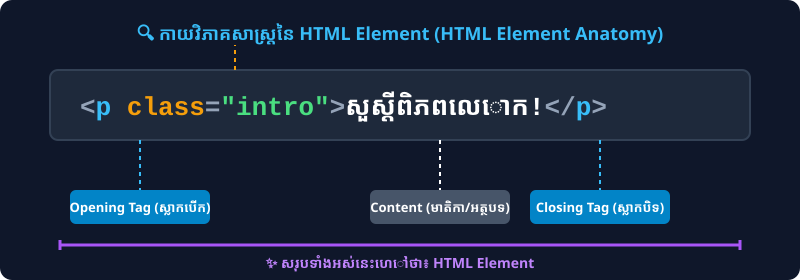

# មេរៀនទី ០៤៖ ធាតុ និងស្លាកក្នុង HTML (HTML Elements & Tags)

> **HTML Element គឺជាប្លុកគ្រឹះនៃទំព័រ HTML ដែលកំណត់ដោយ Start Tag, Content និង End Tag។**

---

## 🔍 កាយវិភាគសាស្ត្រនៃ HTML Element (HTML Element Anatomy)

<p align="center">
  
</p>

---

## ១. តើអ្វីជា HTML Element? (What is an HTML Element?)

HTML Element ភាគច្រើនផ្សំឡើងដោយ ៣ ផ្នែកសំខាន់ៗ៖
1. **Start Tag (Opening Tag):** ស្លាកបើក ដូចជា `<h1>`, `<p>`, `<div>`
2. **Content:** ខ្លឹមសារអត្ថបទ ឬធាតុដទៃទៀតដែលនៅខាងក្នុង
3. **End Tag (Closing Tag):** ស្លាកបិទដែលមានសញ្ញា Slash (`/`) ដូចជា `</h1>`, `</p>`, `</div>`

### ឧទាហរណ៍ជាក់ស្តែង៖
```html
<h1>នេះគឺជាចំណងជើងធំ</h1>
<p>នេះគឺជាកថាខណ្ឌអត្ថបទ។</p>
<button>ចុចទីនេះ</button>
```

---

## ២. ធាតុគ្មានស្លាកបិទ (Empty / Void Elements)

មាន HTML Elements មួយចំនួន **មិនមានមាតិកា (No Content)** និង **មិនមាន End Tag** ឡើយ ដែលត្រូវបានហៅថា **Empty Elements** ឬ **Void Elements**៖

| Empty Tag | តួនាទី (Description) | ឧទាហរណ៍ (Example) |
| :--- | :--- | :--- |
| `<br>` | ចុះបន្ទាត់ថ្មី (Line Break) | `ជួរទី ១<br>ជួរទី ២` |
| `<hr>` | បន្ទាត់ផ្តេកខណ្ឌមាតិកា (Horizontal Rule) | `<p>ផ្នែកទី ១</p><hr><p>ផ្នែកទី ២</p>` |
| `` | បង្ហាញរូបភាព (Image) | `` |
| `<input>` | ប្រអប់បញ្ចូលទិន្នន័យ (Input Field) | `<input type="text">` |
| `<meta>` | កំណត់ Metadata ក្នុង `<head>` | `<meta charset="UTF-8">` |
| `<link>` | ភ្ជាប់ឯកសារក្រៅ (CSS/Favicon) | `<link rel="stylesheet" href="style.css">` |

> 💡 **ចំណាំ:** ក្នុង HTML5 យើងអាចសរសេរ `<br>` ឬ `<br />` ក៏បាន ប៉ុន្តែស្តង់ដារ HTML5 ណែនាំឱ្យសរសេរ `<br>` ធម្មតា។

---

## ៣. ធាតុបង្កប់ក្នុងធាតុ (Nested HTML Elements)

HTML Elements អាចត្រូវបានដាក់បង្កប់នៅក្នុង Elements ផ្សេងទៀត (Nested Elements)៖

```html
<!DOCTYPE html>
<html>
  <body>
    <div>
      <h2>ចំណងជើងរង</h2>
      <p>កថាខណ្ឌដែលមានអក្សរ <b>ដិត</b> និង <i>ទ្រេត</i> នៅខាងក្នុង។</p>
    </div>
  </body>
</html>
```

> ⚠️ **កំហុសទូទៅ (Common Mistake):** ត្រូវបិទ Tag តាមលំដាប់លំដោយត្រឹមត្រូវ (First In, Last Out)៖
> * ✅ ត្រឹមត្រូវ: `<p>អត្ថបទ <b>ដិត</b></p>`
> * ❌ ខុស: `<p>អត្ថបទ <b>ដិត</p></b>` (Tag `<b>` បើកក្រោយ តែទៅបិទក្រៅ `<p>`)

---

## ✍️ លំហាត់អនុវត្តសម្រាប់សិស្ស (Practice Exercises)

1. តើ HTML Element និង HTML Tag ខុសគ្នាយ៉ាងដូចម្តេច?
2. ចូររៀបរាប់ឈ្មោះ Empty Elements យ៉ាងហោចណាស់ ៤ ឱ្យបានត្រឹមត្រូវ។
3. ចូរសរសេរកូដមួយកថាខណ្ឌ `<p>` ដែលមានបង្កប់ `<mark>`, `<b>`, និង `<br>` នៅខាងក្នុង។
