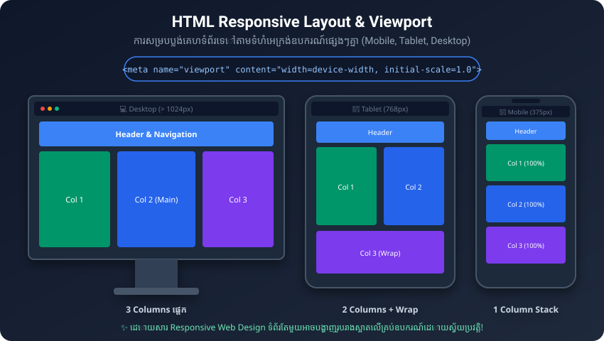

# មេរៀនទី ២៥៖ ប្លង់គេហទំព័រ និង Responsive Design (HTML Layout & Responsive)

> **Responsive Web Design គឺជាបច្ចេកទេសសាងសង់គេហទំព័រដែលឆ្លើយតប និងបង្ហាញរូបរាងស្អាតលើគ្រប់ទំហំអេក្រង់ ដូចជា ទូរស័ព្ទដៃ Tablet និងកុំព្យូទ័រ (Desktops)។**

---

## ១. គ្រឹះនៃ Responsive Design: Setting The Viewport



ដើម្បីឱ្យគេហទំព័រ Support Responsive Design យើងត្រូវតែដាក់ Meta Viewport នៅក្នុង `<head>`៖

```html
<meta name="viewport" content="width=device-width, initial-scale=1.0">
```

### ការពន្យល់អំពី Viewport Attributes:
* `width=device-width`: កំណត់ទទឹងទំព័រឱ្យស្មើនឹងទទឹងអេក្រង់ពិតប្រាកដរបស់ឧបករណ៍ (Device Screen Width)។
* `initial-scale=1.0`: កំណត់កម្រិត Zoom ដំបូងនៅពេល Browser បើកទំព័រឡើង (1:1 Scale)។

---

## ២. ប្លង់គ្រោងឆ្អឹងគេហទំព័រស្តង់ដារ (Website Layout Components)

គេហទំព័រភាគច្រើនតែងតែមានផ្នែកសំខាន់ៗដូចខាងក្រោម៖

```text
+-------------------------------------------------------+
|  <header> - ចំណងជើងមេ / Logo គេហទំព័រ                |
+-------------------------------------------------------+
|  <nav> - របារ Menu សម្រាប់ចុចផ្លាស់ទី (Navigation)    |
+---------------------------+---------------------------+
|  <main>                   |  <aside>                  |
|  - <section>              |  - ព័ត៌មានបន្ថែម (Sidebar) |
|  - <article>              |  - Related links          |
|  ខ្លឹមសារស្នូលនៃទំព័រ     |                           |
+---------------------------+---------------------------+
|  <footer> - ព័ត៌មាន Copyright / Social Links         |
+-------------------------------------------------------+
```

---

## ៣. បច្ចេកវិទ្យាបង្កើត Layout ក្នុង CSS ទំនើប

1. **CSS Flexbox (Flexible Box):** ស័ក្តិសមសម្រាប់រៀបចំ Layout មួយវិមាត្រ (1D: ជួរដេក ឬជួរឈរ ដូចជា Navigation Bar, List of Cards)
2. **CSS Grid:** ស័ក្តិសមសម្រាប់រៀបចំប្លង់គេហទំព័រធំពីរវិមាត្រ (2D: ទាំង Rows និង Columns)
3. **CSS Media Queries (`@media`):** កំណត់ Style ខុសៗគ្នាតាមទំហំអេក្រង់ Screen Resolution៖
   ```css
   /* នៅលើទូរស័ព្ទដៃ (អេក្រង់តូចជាង 600px) */
   @media (max-width: 600px) {
     .container {
       flex-direction: column;
     }
   }
   ```

---

## ✍️ លំហាត់អនុវត្តសម្រាប់សិស្ស (Practice Exercises)

1. តើនឹងមានអ្វីកើតឡើងចំពោះគេហទំព័រនៅលើទូរស័ព្ទដៃ ប្រសិនបើយើងភ្លេចដាក់ `<meta name="viewport">`?
2. ចូរបង្កើត Layout សាមញ្ញមួយដែលមាន Header, Nav, Main (Content), Aside (Sidebar), និង Footer។
