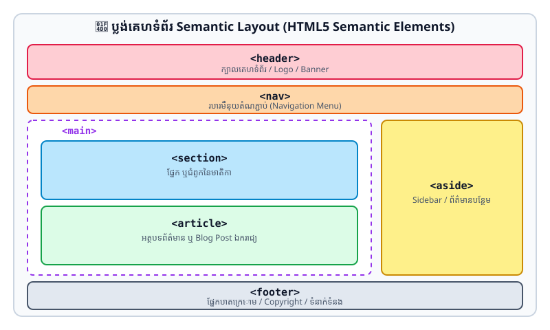

# មេរៀនទី ២៧៖ ធាតុ Semantic ស្តង់ដារ (HTML Semantic Elements)

> **Semantic Element គឺជាធាតុដែលបញ្ជាក់ពីអត្ថន័យ និងតួនាទីយ៉ាងច្បាស់លាស់ដល់ទាំង Browser និង Developer។**

---

## 📐 ប្លង់គេហទំព័រ Semantic Layout (Visual Architecture)

<p align="center">
  
</p>

---

## ១. តើអ្វីជា Semantic Element? (What are Semantic Elements?)

* **Non-semantic Elements:** មិនបញ្ជាក់ពីអត្ថន័យនៃមាតិកាឡើយ (ឧទាហរណ៍ `<div>` និង `<span>` គ្រាន់តែជាប្រអប់ទទេ)។
* **Semantic Elements:** បញ្ជាក់ពីអត្ថន័យយ៉ាងច្បាស់លាស់ (ឧទាហរណ៍ `<form>`, `<table>`, `<article>`, `<header>`, `<footer>`)។

---

## ២. បណ្តា Semantic Elements សំខាន់ៗក្នុង HTML5

| Tag | តួនាទី និងការប្រើប្រាស់ (Description) |
| :--- | :--- |
| `<header>` | ផ្នែកក្បាលទំព័រ ឬក្បាលនៃអត្ថបទ (មាន Logo, ឈ្មោះទំព័រ) |
| `<nav>` | ផ្នែកប្រមូលផ្តុំតំណភ្ជាប់ Menu (Navigation Links) |
| `<main>` | ផ្នែកមាតិកាស្នូលផ្តាច់មុខនៃទំព័រ (មានតែមួយគត់ក្នុងទំព័រ) |
| `<section>` | ផ្នែក ឬជំពូកដាច់ដោយឡែកមួយនៃមាតិកា |
| `<article>` | អត្ថបទដែលឯករាជ្យ និងមានន័យពេញលេញដោយខ្លួនឯង (Blog Post, News Story) |
| `<aside>` | ព័ត៌មានបន្ទាប់បន្សំ ឬ Sidebar |
| `<footer>` | ផ្នែកបាតក្រោមនៃទំព័រ (Copyright, Contacts, Terms) |
| `<figure>` | ក្តោបរូបភាព ឬគំនូសតាង |
| `<figcaption>` | ចំណងជើង ឬអត្ថបទពន្យល់រូបភាពក្នុង `<figure>` |
| `<time>` | កំណត់កាលបរិច្ឆេទ ឬពេលវេលា |

---

## ៣. ហេតុអ្វីបានជាត្រូវប្រើប្រាស់ Semantic HTML?

1. **Search Engine Optimization (SEO):** Google អាចស្គាល់បានភ្លាមថាតើផ្នែកណាជាមាតិកាចម្បង (`<main>`), ផ្នែកណាជាអត្ថបទ (`<article>`) និងផ្នែកណាជា Menu (`<nav>`)។
2. **Accessibility (A11y):** Screen Readers សម្រាប់ជនពិការភ្នែកអាចអាន និងបញ្ជាទិសដៅបានត្រឹមត្រូវ។
3. **Clean & Readable Code:** ជួយឱ្យកូដស្អាត ងាយស្រួល Maintain ជាងការប្រើ `<div>` ជាន់ `<div>` រាប់សិបជាន់។

```html
<!-- ឧទាហរណ៍រចនាសម្ព័ន្ធ Semantic ពេញលេញ -->
<header>
  <h1>ប្លក់បច្ចេកវិទ្យា</h1>
  <nav>
    <a href="#home">ទំព័រដើម</a> | <a href="#news">ព័ត៌មាន</a>
  </nav>
</header>

<main>
  <article>
    <h2>ចំណងជើងអត្ថបទព័ត៌មាន</h2>
    <p>ចុះផ្សាយនៅថ្ងៃទី <time datetime="2026-09-23">២៣ កញ្ញា ២០២៦</time></p>
    <figure>
      
      <figcaption>រូបភាពទី ១៖ ថ្នាក់រៀន Web Development</figcaption>
    </figure>
    <p>ខ្លឹមសារព័ត៌មានលម្អិត...</p>
  </article>
</main>

<footer>
  <p>&copy; 2026 រក្សាសិទ្ធិគ្រប់យ៉ាង</p>
</footer>
```

---

## ✍️ លំហាត់អនុវត្តសម្រាប់សិស្ស (Practice Exercises)

1. ចូរពន្យល់ពីភាពខុសគ្នារវាង `<section>` និង `<article>`។
2. បំប្លែងកូដចាស់ដែលប្រើ `<div>` ច្រើនជាន់ ឱ្យក្លាយទៅជាកូដ Semantic HTML5 ត្រឹមត្រូវតាមស្តង់ដារ។
