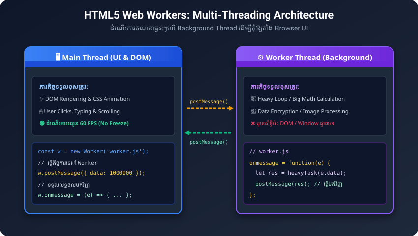

# មេរៀនទី ៤៦៖ Web Workers API (ការដំណើរការលើ Background)

> **Web Worker គឺជាកូដ JavaScript ដែលដំណើរការនៅលើ Background Thread ដាច់ដោយឡែក ដោយមិនរំខាន ឬធ្វើឱ្យគាំងផ្ទាំង UI របស់ Browser ឡើយ។**

---

## ១. ហេតុអ្វីបានជាយើងត្រូវការ Web Workers?



ធម្មតាកូដ JavaScript លើ Browser ដំណើរការលើ **Single Thread** (Main Thread)។ ប្រសិនបើយើងដំណើរការកូដគណនាធ្ងន់ៗ (ដូចជា ការគណនាទិន្នន័យរាប់លាន ដំណើរការរូបភាព ឬស្វែងរកលេខបឋម) នោះទំព័រ Web នឹង **កកគាំង (Freeze / Unresponsive)** មិនអាចចុចប៊ូតុង ឬ scroll បានឡើយ។

**Web Worker** ដោះស្រាយបញ្ហានេះដោយផ្ទេរការគណនាធ្ងន់ៗទៅដំណើរការលើ **Background Thread**។

---

## ២. ឧទាហរណ៍នៃការបង្កើត Web Worker

### ជំហានទី ១: បង្កើត File JavaScript សម្រាប់ Worker (`worker.js`)
```javascript
// worker.js
let count = 0;

function timedCount() {
  count++;
  // ផ្ញើសារត្រឡប់ទៅកាន់ Main Thread
  postMessage(count);
  setTimeout(timedCount, 1000);
}

timedCount();
```

### ជំហានទី ២: ហៅប្រើ Worker ក្នុងឯកសារ HTML (`index.html`)
```html
<!DOCTYPE html>
<html lang="km">
<head>
  <meta charset="UTF-8">
  <title>Web Worker Demo</title>
</head>
<body>

  <h2>ការរាប់លេខលើ Background ដោយ Web Worker</h2>
  <p>ចំនួនរាប់បច្ចុប្បន្ន៖ <output id="result">0</output></p>
  <button onclick="startWorker()">▶️ ចាប់ផ្តើម Worker</button>
  <button onclick="stopWorker()">⏹️ បញ្ឈប់ Worker</button>

  <script>
    let w;

    function startWorker() {
      if (typeof(Worker) !== "undefined") {
        if (typeof(w) === "undefined") {
          // បង្កើត Worker ថ្មី
          w = new Worker("worker.js");
        }
        // ទទួលទិន្នន័យពី Worker
        w.onmessage = function(event) {
          document.getElementById("result").innerHTML = event.data;
        };
      } else {
        alert("Browser របស់អ្នកមិនគាំទ្រ Web Workers ទេ!");
      }
    }

    function stopWorker() {
      if (w) {
        w.terminate(); // បញ្ឈប់ Worker
        w = undefined;
      }
    }
  </script>

</body>
</html>
```

---

## ៣. ចំណុចរឹតបន្តឹងរបស់ Web Worker

ដោយសារ Web Worker ដំណើរការលើ Thread ដាច់ដោយឡែក វា **មិនអាចចូលប្រើប្រាស់ (No Access)** ធាតុខាងក្រោមនេះបានឡើយ៖
* ❌ `window` object
* ❌ `document` object (មិនអាចកែប្រែ DOM ដោយផ្ទាល់ទេ)
* ❌ `parent` object

---

## ✍️ លំហាត់អនុវត្តសម្រាប់សិស្ស (Practice Exercises)

1. តើបញ្ហាអ្វីដែលនឹងកើតឡើង ប្រសិនបើយើងដំណើរការកូដគណនាគណិតវិទ្យាដ៏ធំមួយលើ Main Thread របស់ Browser?
2. តើ Web Worker និង Main Thread ទាក់ទងគ្នា (Communicate) តាមរយៈវិធីសាស្ត្រណា?
