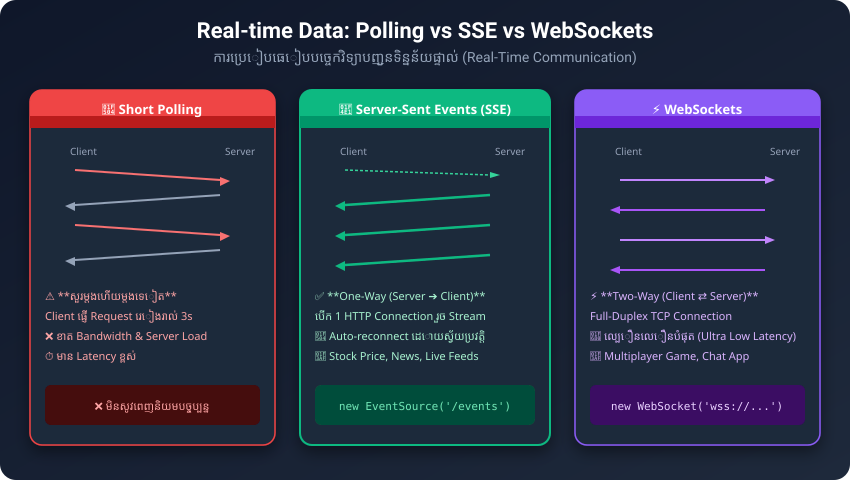

# មេរៀនទី ៤៧៖ Server-Sent Events API (ការទទួល Real-time Events)

> **Server-Sent Events (SSE) អនុញ្ញាតឱ្យគេហទំព័រអាចទទួលទិន្នន័យអាប់ដេតស្វ័យប្រវត្តិពី Web Server (Real-time Updates) តាមទិសដៅតែមួយ (One-Way Streaming) ដោយមិនចាំបាច់ចុច Refresh ឬ Request សួរដដែលៗឡើយ។**

---

## ១. របៀបដែល SSE ដំណើរការ



* ក្នុងវិធីសាស្ត្រធម្មតា (Traditional Polling) Browser ត្រូវផ្ញើ Request ទៅសួរ Server រាល់ប៉ុន្មានវិនាទីម្តង ("តើមានទិន្នន័យថ្មីទេ?")។
* ក្នុង **Server-Sent Events** Browser បើក Connection តែម្តងជាមួយ Server ហើយ Server នឹង **Push (រុញ)** ទិន្នន័យថ្មីៗមកកាន់ Browser ដោយស្វ័យប្រវត្ត រាល់ពេលមាន Updates (ដូចជា តម្លៃទីផ្សារភាគហ៊ុន ព័ត៌មានទាន់ហេតុការណ៍ ឬលទ្ធផលបាល់ទាត់)។

---

## ២. ការប្រើប្រាស់ JavaScript `EventSource`

```html
<!DOCTYPE html>
<html lang="km">
<head>
  <meta charset="UTF-8">
  <title>Server-Sent Events Demo</title>
</head>
<body>

  <h2>ព័ត៌មានអាប់ដេត Real-time ពី Server</h2>
  <div id="updates" style="border: 1px solid #ccc; padding: 16px; background: #f8fafc; border-radius: 8px;">
    កំពុងរង់ចាំទិន្នន័យពី Server...
  </div>

  <script>
    if (typeof(EventSource) !== "undefined") {
      // ១. បង្កើតការតភ្ជាប់ទៅកាន់ SSE Endpoint លើ Server
      const source = new EventSource("https://example.com/sse-feed");

      // ២. ចាប់យកទិន្នន័យពេល Server ផ្ញើសារមក
      source.onmessage = function(event) {
        document.getElementById("updates").innerHTML += `<br>📢 ${event.data}`;
      };

      // ៣. ដោះស្រាយបញ្ហា Error ពេលដាច់ Connection
      source.onerror = function(err) {
        console.error("SSE Connection Failed:", err);
      };
    } else {
      document.getElementById("updates").innerHTML = "Browser របស់អ្នកមិនគាំទ្រ Server-Sent Events ទេ។";
    }
  </script>

</body>
</html>
```

---

## ៣. ភាពខុសគ្នារវាង Server-Sent Events vs WebSockets

| លក្ខណៈសម្បត្តិ | Server-Sent Events (SSE) | WebSockets |
| :--- | :--- | :--- |
| **ទិសដៅទិន្នន័យ** | **ទិសដៅតែមួយ (One-way):** Server -> Client | **ទិសដៅទាំងពីរ (Two-way / Bi-directional):** Client <-> Server |
| **Protocol** | ប្រើប្រាស់ស្តង់ដារ **HTTP** ធម្មតា | ប្រើប្រាស់ **WS / WSS** Protocol ដាច់ដោយឡែក |
| **ការភ្ជាប់ឡើងវិញ** | ភ្ជាប់ឡើងវិញស្វ័យប្រវត្ត (Auto-reconnect) | ត្រូវសរសេរកូដ Handle Reconnect ខ្លួនឯង |
| **ការប្រើប្រាស់ល្អបំផុត** | Stock Tickers, News Feeds, Live Notifications | Chat Apps, Multiplayer Games |

---

## ✍️ លំហាត់អនុវត្តសម្រាប់សិស្ស (Practice Exercises)

1. ចូរពន្យល់ពីអត្ថប្រយោជន៍នៃ Server-Sent Events ធៀបនឹងការ Polling សួរ Server ដដែលៗ។
2. តើនៅពេលណាដែលយើងគួរជ្រើសរើសប្រើ WebSockets ជាជាង SSE?
